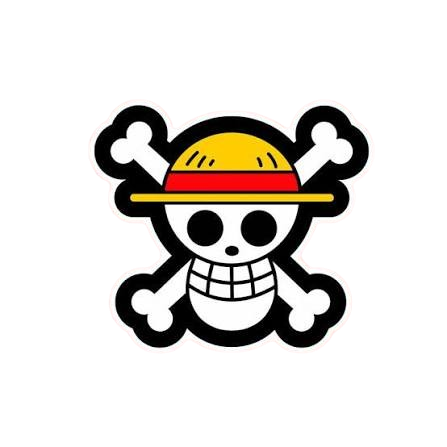

<div align="center">



# GRAND LINE // 偉大なる航路（グランド・ライン）

[](https://git.io/typing-svg)

<!-- Animated Sailing Ship Banner across the Grand Line -->


*“富、名声、力…… この世のすべてを手に入れた男、海賊王ゴールド・ロジャー。彼の死際に放った一言が、人々を海へ駆り立てる――  
『俺の財宝か？ 欲しければくれてやる。探してみろ、この世のすべてをそこに置いてきた！』”*

<br>

[](https://grandlinearch.vercel.app/)
[](https://github.com/mhdhamka/grandline/issues)
[](https://github.com/mhdhamka/grandline/issues)

<br>


</div>

---

## What is this?

As the **Elbaph Arc** builds toward the epic clash of **Luffy vs. Saint Nerona Imu**, are you tired of the historical timeline crumbling beneath your feet while the World Government races to erase the **Void Century** (空白の100年) and bury the secrets of the Ancient Kingdom?

**Grand Line** (偉大なる航路) is a fully interactive, manga panel inspired web app built for true pirates who want to track the road to Laugh Tale without getting wiped out by a Buster Call. It features custom manga dialogue speech bubbles (`MangaBubble`), dynamic island-to-island status trackers.

---

###  主な機能 (Key Features)

| Feature | Description |
| :--- | :--- |
| ** ナビバー航海ドック** | A Thousand Sunny deck-inspired 10-stage interactive menu for seamless traversal across all app modules. |
| ** 漫画バブル (`MangaBubble`)** | Classic, rubber-hose comic book panels infused with Egghead future-tech aesthetics. |
| ** ログポーズ (Log Pose)** | Track your voyage arc-by-arc across the seas with detailed summaries, debut powers, and antagonists. |
| ** 歴史の本文 (Poneglyphs)** | Uncover ancient texts and historical records leading to the truth of the world. |
| ** 麦わらの一味 (Nakama)** | TCG-inspired character profiles tracking bios, dreams, origins, roles, devil fruits, weapons, and bounties. |
| ** ギア覚醒 (Gear Matrix)** | Explore transformations and power-ups for Luffy and the crew. |
| ** 悪魔の実系統 (Devil Fruits)** | Comprehensive archives covering devil fruit lore and classifications. |
| ** 強敵ファイル (Villains)** | Detailed files on primary antagonists from every major saga and arc. |
| ** 手配書生成 (Bounty Poster)** | Custom Morgan-style poster generator to create, import, and track chronological bounty ascensions. |
| ** 覇気鍛錬 (Haki Mastery)** | Deep-dive into Haki with live simulations for Haoshoku and Kenbunshoku Haki. |
| ** 劇場版回顾 (Cinematics)** | Complete catalog of One Piece feature films up to *Film Red*. |
| ** ベガパンクAI (Vegapunk)** | Egghead future-tech cybernetic terminal powered by Gemini 2.5 featuring Vegapunk, Shaka, and Lilith. |

---

## Tech Stack

| Category | Technology & Specification |
| :--- | :--- |
| **Frontend** | TS React + Vite (Lightning-fast sea shifts across the Calm Belt) |
| **Styling** | Tailwind CSS (Custom Cybernetic HUD Utilities & Manga Grids) |
| **Icons** | Lucide React & Grand Line Hegemony Assets |
| **Brain** | Google Gemini 2.5 API (Powered by Poneglyph Clearance) |

---

## Quick Start (Deploy the Grand Line Network)

Clone the repository and boot up your local ship bunker in seconds:

```bash
# 1. Clone the repository
git clone [https://github.com/mhdhamka/grandline.git](https://github.com/mhdhamka/grandline.git)
cd grandline

# 2. Install dependencies
npm install

# 3. Set up your secret Grand Line AI key
echo "GEMINI_API_KEY=your_actual_api_key_here" > .env.local

# 4. Launch the Grand Line protocol workspace!
npm run dev

```

Open **`http://localhost:3000`** in your browser and set sail for Laugh Tale!

---

Developed with absolute authority by [mhdhamka](https://github.com/mhdhamka)

If this protocol saved your ship from a Buster Call, drop a star!

